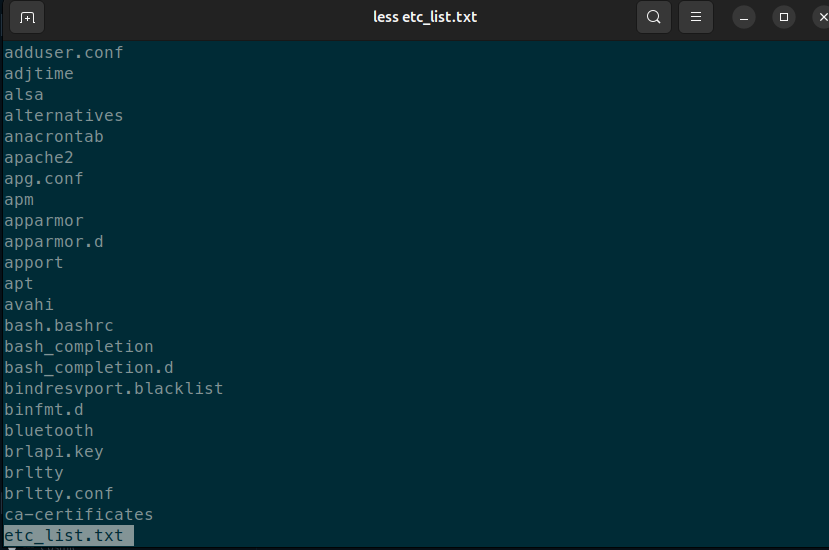

# Họ và tên: Võ Văn Tùng
# MSSV: 22120409
# Homework 1: Linux Command Line Basics

## Task 1: System Investigation
- Find out what directory you are currently in.
    - Dùng lệnh `pwd`
    - Lệnh pwd hiển thị đường dẫn tuyệt đối của thư mục hiện tại
- Go to the Documents directory inside your home directory using a relative path
    - Dùng lệnh `cd Documents`
    - Lệnh `cd` dùng để thay đổi thư mục hiện tại, sử dụng "Documents" như một đường dẫn tương đối có nghĩa là chúng ta di chuyển đến thư mục Documents trong thư mục hiện tại.
- Confirm your new location
    - Dùng lệnh `pwd`
    - Lệnh `pwd` hiển thị đường dẫn tuyệt đối của thư mục hiện tại, giúp xác nhận rằng đã di chuyển đến thư mục Documents.
- Kết quả:
  ~ ❯ pwd                                                         
/home/c0smic

  ~ ❯ cd Documents                                                

  ~/Documents ❯ pwd                                               
/home/c0smic/Documents


## Task 2: Directory Setup
- Create a folder named project_logs in your current directory
    - Dùng lệnh `mkdir project_logs`
    - Lệnh `mkdir` được sử dụng để tạo một thư mục mới có tên là "project_logs" trong thư mục hiện tại.
- Inside it, create subfolders old_backup, archive, and current. Then, create a file temp.txt
    - Dùng lệnh: 
        ```bash
        cd project_logs
        mkdir old_backup archive current
        touch temp.txt
        ```
    - Lệnh `cd project_logs` chuyển vào thư mục "project_logs" vừa tạo. Lệnh `mkdir old_backup archive current` tạo ba thư mục con bên trong "project_logs". Lệnh `touch temp.txt` tạo một tệp trống có tên "temp.txt" trong thư mục hiện tại.
- Verify that they exist.
    - Dùng lệnh `ls -l`
    - Lệnh `ls -l` liệt kê các tệp và thư mục trong thư mục hiện tại với định dạng chi tiết, xác nhận rằng các thư mục con và tệp đã được tạo thành công.
- Kết quả:
  ~/Documents ❯ cd ..                                             

  ~ ❯ mkdir project_logs                                         

  ~ ❯ cd project_logs                                             

  ~/project_logs ❯ mkdir old_backup archive current              

  ~/project_logs ❯ touch temp.txt                                 

  ~/project_logs ❯ ls -l                                          
total 12
drwxrwxr-x 2 c0smic c0smic 4096 Oct  3 00:11 archive
drwxrwxr-x 2 c0smic c0smic 4096 Oct  3 00:11 current
drwxrwxr-x 2 c0smic c0smic 4096 Oct  3 00:11 old_backup
-rw-rw-r-- 1 c0smic c0smic    0 Oct  3 00:11 temp.txt

  ~/project_logs ❯                                                

## Task 3: Log Review
- You received a system log file at /var/log/syslog.
- Display the last 10 lines.
    - Dùng lệnh `tail -10 /var/log/syslog`
    - Lệnh `tail -10 /var/log/syslog` hiển thị 10 dòng cuối cùng của file được chỉ định.
    - Kết quả:
tail -10 /var/log/syslog                                     
2025-10-03T00:16:08.632971+07:00 C0smic systemd[1]: Finished man-db.service - Daily man-db regeneration.
2025-10-03T00:16:09.592113+07:00 C0smic systemd[2542]: Started snap.canonical-livepatch.canonical-livepatch-8150c0bb-9fa5-4145-839c-62da6025fe54.scope.
2025-10-03T00:16:09.866486+07:00 C0smic systemd[2542]: Started snap.canonical-livepatch.canonical-livepatch-e58e4117-2486-4805-afef-3e20e39d411f.scope.
2025-10-03T00:16:09.939876+07:00 C0smic systemd[2542]: Started snap.canonical-livepatch.canonical-livepatch-53a61919-018b-422d-bf67-d7b316bd1a76.scope.
2025-10-03T00:16:10.015461+07:00 C0smic systemd[2542]: Started snap.canonical-livepatch.canonical-livepatch-f3aee4ac-7922-4d46-9954-1e4d356c3db8.scope.
2025-10-03T00:16:11.199082+07:00 C0smic systemd[1]: snap.firefox.hook.configure-1cb099f7-7602-48f6-8bd0-b7d0a8c1643d.scope: Deactivated successfully.
2025-10-03T00:16:12.736250+07:00 C0smic snapd[1061]: storehelpers.go:916: cannot refresh snap "firefox": snap has no updates available
2025-10-03T00:17:01.182426+07:00 C0smic CRON[49362]: (root) CMD (cd / && run-parts --report /etc/cron.hourly)
2025-10-03T00:17:32.612150+07:00 C0smic code.desktop[6382]: [6382:1003/001732.611887:ERROR:content/browser/browser_main_loop.cc:278] GLib-GObject: ../../../gobject/gsignal.c:2685: instance '0x14402562450' has no handler with id '4021'
2025-10-03T00:17:59.119631+07:00 C0smic tracker-miner-fs-3[49756]: (tracker-extract-3:49756): GLib-GIO-WARNING **: 00:17:59.119: Error creating IO channel for /proc/self/mountinfo: Invalid argument (g-io-error-quark, 13)

- Display the first 5 lines of the file
    - Dùng lệnh `head -5 /var/log/syslog`
    - Lệnh `head -5 /var/log/syslog` hiển thị 5 dòng đầu tiên của file.
    - Kết quả:  
  ~ ❯ head -5 /var/log/syslog                                     
2025-09-28T00:00:01.302171+07:00 C0smic rsyslogd: [origin software="rsyslogd" swVersion="8.2312.0" x-pid="1220" x-info="https://www.rsyslog.com"] rsyslogd was HUPed
2025-09-28T00:00:01.305636+07:00 C0smic systemd[1]: logrotate.service: Deactivated successfully.
2025-09-28T00:00:01.305888+07:00 C0smic systemd[1]: Finished logrotate.service - Rotate log files.
2025-09-28T00:00:02.141675+07:00 C0smic kernel: audit: type=1400 audit(1758992402.140:171): apparmor="DENIED" operation="open" class="file" profile="snap.firmware-updater.firmware-notifier" name="/proc/sys/vm/max_map_count" pid=18436 comm="firmware-notifi" requested_mask="r" denied_mask="r" fsuid=1000 ouid=0
2025-09-28T00:04:18.272366+07:00 C0smic NetworkManager[1236]: <info>  [1758992658.2721] dhcp4 (wlo1): state changed new lease, address=192.168.87.245

- Reverse the content of the file for a quick scan.
    - Dùng lệnh `tac /var/log/syslog`
    - Lệnh `tac` đảo ngược thứ tự các dòng trong file, hiển thị dòng cuối trước.
    - Kết quả:  
  ~ ❯ tac /var/log/syslog                          
2025-10-03T00:28:30.407681+07:00 C0smic brave-browser.desktop[4702]: ", source: chrome-extension://mnojpmjdmbbfmejpflffifhffcmidifd/_generated_background_page.html (0)
2025-10-03T00:28:30.407669+07:00 C0smic brave-browser.desktop[4702]: [4703:4703:1003/002830.406350:ERROR:CONSOLE:0] "Refused to load the script 'https://cdn.oaistatic.com/assets/hy9dbhfxwhp2axlc.js' because it violates the following Content Security Policy directive: "script-src 'self' 'wasm-eval'". Note that 'script-src-elem' was not explicitly set, so 'script-src' is used as a fallback.
2025-10-03T00:28:30.407659+07:00 C0smic brave-browser.desktop[4702]: ", source: chrome-extension://mnojpmjdmbbfmejpflffifhffcmidifd/_generated_background_page.html (0)
2025-10-03T00:28:30.407644+07:00 C0smic brave-browser.desktop[4702]: [4703:4703:1003/002830.406306:ERROR:CONSOLE:0] "Refused to load the script 'https://cdn.oaistatic.com/assets/hy9dbhfxwhp2axlc.js' because it violates the following Content Security Policy directive: "script-src 'self' 'wasm-eval'". Note that 'script-src-elem' was not explicitly set, so 'script-src' is used as a fallback.
2025-10-03T00:28:30.407633+07:00 C0smic brave-browser.desktop[4702]: ", source: chrome-extension://mnojpmjdmbbfmejpflffifhffcmidifd/_generated_background_page.html (0)


## Task 4: Pattern Search
- Search for all lines that contain the word error (case-insensitive).
    - Dùng lệnh `l`
    - Lệnh `grep -i "error" /var/log/syslog` tìm kiếm tất cả các dòng trong file chứa từ "error", không phân biệt chữ hoa hay chữ thường.
    - Kết quả:  
      ~ ❯ grep -i "error" /var/log/syslog                              
2025-09-28T00:12:37.576556+07:00 C0smic brave-browser.desktop[6171]: [6172:6172:0928/001237.576331:ERROR:mojo/public/cpp/bindings/lib/interface_endpoint_client.cc:732] Message 0 rejected by interface blink.mojom.WidgetHost
2025-09-28T00:19:17.718197+07:00 C0smic brave-browser.desktop[6171]: Fontconfig error: Cannot load default config file: No such file: (null)
2025-09-28T00:21:35.554516+07:00 C0smic brave-browser.desktop[6171]: [6172:6172:0928/002135.554197:ERROR:CONSOLE:1] "Error retrieving backup results: [object Object]", source: chrome-extension://mnojpmjdmbbfmejpflffifhffcmidifd/out/brave_web-discovery-project_index_js.chunk.js (1)
2025-09-28T00:44:31.112889+07:00 C0smic brave-browser.desktop[6171]: [6209:6209:0928/004431.112533:ERROR:gpu/command_buffer/service/shared_image/shared_image_manager.cc:389] SharedImageManager::ProduceSkia: Trying to Produce a Skia representation from a non-existent mailbox.
2025-09-28T00:44:31.119359+07:00 C0smic brave-browser.desktop[6171]: [6209:6209:0928/004431.113902:ERROR:gpu/command_buffer/service/shared_image/shared_image_manager.cc:389] SharedImageManager::ProduceSkia: Trying to Produce a Skia representation from a non-existent mailbox.
2025-09-28T00:44:31.119856+07:00 C0smic brave-browser.desktop[6171]: [6209:6209:0928/004431.115024:ERROR:gpu/command_buffer/service/shared_image/shared_image_manager.cc:389] SharedImageManager::ProduceSkia: Trying to Produce a Skia representation from a non-existent mailbox.

- Save only these lines to a file called errors.log.
    - Dùng lệnh `grep -i "error" /var/log/syslog > errors.log`
    - Lệnh `>` chuyển hướng đầu ra của lệnh grep vào tệp "errors.log", lưu các dòng tìm được vào tệp này.
    - Kết quả:  
  ~ ❯ grep -i "error" /var/log/syslog > errors.log         
  ~ ❯ cat errors.log | head -5                                    
2025-09-28T00:12:37.576556+07:00 C0smic brave-browser.desktop[6171]: [6172:6172:0928/001237.576331:ERROR:mojo/public/cpp/bindings/lib/interface_endpoint_client.cc:732] Message 0 rejected by interface blink.mojom.WidgetHost
2025-09-28T00:19:17.718197+07:00 C0smic brave-browser.desktop[6171]: Fontconfig error: Cannot load default config file: No such file: (null)
2025-09-28T00:21:35.554516+07:00 C0smic brave-browser.desktop[6171]: [6172:6172:0928/002135.554197:ERROR:CONSOLE:1] "Error retrieving backup results: [object Object]", source: chrome-extension://mnojpmjdmbbfmejpflffifhffcmidifd/out/brave_web-discovery-project_index_js.chunk.js (1)
2025-09-28T00:44:31.112889+07:00 C0smic brave-browser.desktop[6171]: [6209:6209:0928/004431.112533:ERROR:gpu/command_buffer/service/shared_image/shared_image_manager.cc:389] SharedImageManager::ProduceSkia: Trying to Produce a Skia representation from a non-existent mailbox.
2025-09-28T00:44:31.119359+07:00 C0smic brave-browser.desktop[6171]: [6209:6209:0928/004431.113902:ERROR:gpu/command_buffer/service/shared_image/shared_image_manager.cc:389] SharedImageManager::ProduceSkia: Trying to Produce a Skia representation from a non-existent mailbox.

- Count how many such lines exist.​
    - Dùng lệnh `grep -i "error" /var/log/syslog | wc -l`
    - Lệnh `wc -l` đếm số dòng đầu vào, trong trường hợp này là số dòng chứa từ "error".
    - Kết quả:  
  ~ ❯ grep -i "error" /var/log/syslog | wc -l                     
682


## Task 5: Stream Redirection
- Redirect the list of all files in /etc into a file named etc_list.txt without showing it on screen.
    - Dùng lệnh `ls /etc > etc_list.txt`
    - Dấu `>` chuyển hướng đầu ra của ls /etc vào etc_list.txt mà không hiển thị trên màn hình.
    - Kết quả:  
  ~ ❯ ls /etc > etc_list.txt                                     
  ~ ❯ cat etc_list.txt              
adduser.conf  
adjtime
alsa  
alternatives  
anacrontab  
apache2  
apg.conf  
apm  
apparmor  
apparmor.d  
apport  
apt  
avahi  
bash.bashrc  

- Append the list of files from /bin to the same file.​
    - Dùng lệnh `ls /bin >> etc_list.txt`
    - Dấu `>>` thêm đầu ra của ls /bin vào cuối tệp etc_list.txt mà không ghi đè nội dung hiện có.
    - Kết quả:  
  ~ ❯ ls /bin >> etc_list.txt                                    
  ~ ❯ cat etc_list.txt                                          
adduser.conf  
adjtime  
alsa  
alternatives  
anacrontab  
apache2  
apg.conf  
apm  
apparmor  
apparmor.d  
apport  
apt  
avahi

- View the result one page at a time.
    - Dùng lệnh `less etc_list.txt`
    - Lệnh `less` cho phép xem nội dung tệp từng trang 1
    - Kết quả: 

## Task 6: Text Processing
- Create a file users.txt with the following content:​  
    Alice:Admin  
    Bob:User  
    Carol:Guest
    - Dùng lệnh `echo -e "Alice:Admin\nBob:User\nCarol:Guest" > users.txt`
    - Lệnh trên sử dụng echo với tùy chọn -e để nhận ký tự đặc biệt \n và chuyển hướng đầu ra vào file users.txt.
    - Kết quả:
  ~ ❯ echo -e "Alice:Admin\nBob:User\nCarol:Guest" > users.txt  

  ~ ❯ cat users.txt                                              
Alice:Admin
Bob:User
Carol:Guest

- Use cut or awk to extract just the usernames.​
    - Dùng lệnh `cut -d':' -f1 users.txt`
    - Lệnh `cut -d':' -f1 users.txt` sử dụng dấu hai chấm làm dấu phân cách và lấy trường đầu tiên (tên người dùng) từ mỗi dòng trong tệp users.txt.
- Use tr to convert them to lowercase.
    - Dùng lệnh `cut -d':' -f1 users.txt | tr 'A-Z' 'a-z'`
    - Lệnh `tr 'A-Z' 'a-z'` chuyển đổi tất cả các chữ cái in hoa thành chữ thường trong đầu ra của lệnh cut.
- Use sort to display them in reverse alphabetical order.
    - Dùng lệnh `cut -d':' -f1 users.txt | sort -r`
    - Lệnh `sort -r` sắp xếp đầu ra theo thứ tự ngược thứ tự bảng chữ cái.
- Kết quả:  
  ~ ❯ cut -d':' -f1 users.txt                              
Alice  
Bob  
Carol    
  ~ ❯ cut -d':' -f1 users.txt | tr 'A-Z' 'a-z'                  
alice  
bob  
carol    
  ~ ❯ cut -d':' -f1 users.txt | sort -r                        
Carol  
Bob  
Alice  

## Task 7: Cleanup Script
- Remove an empty directory named old_backup​
    - Dùng lệnh `rmdir old_backup`
    - Lệnh `rmdir old_backup` xóa thư mục trống có tên "old_backup".
    - Kết quả:  
  ~/Documents ❯ ls                                               
old_backup  
  ~/Documents ❯ rmdir old_backup                                  
  ~/Documents ❯ ls                                              


- Delete a file named temp.txt​
    - Dùng lệnh `rm temp.txt`
    - Lệnh `rm temp.txt` xóa tệp có tên "temp.txt".
    - Kết quả:  
  ~/Documents ❯ ls                                               
temp.txt  
  ~/Documents ❯ rm temp.txt                                       
  ~/Documents ❯ ls                                              

- Move a file report.txt to the archive folder​
    - Dùng lệnh `mv report.txt archive/`
    - Lệnh `mv report.txt archive/` di chuyển tệp "report.txt" vào thư mục "archive".
    - Kết quả:  
  ~/Documents ❯ mv report.txt archive/                       
  ~/Documents ❯ ls archive                                     
report.txt

-​ Copy archive/report.txt to current/report_backup.txt​  
    - Dùng lệnh `cp archive/report.txt current/report_backup.txt`
    - Lệnh `cp archive/report.txt current/report_backup.txt` sao chép tệp "report.txt" từ thư mục "archive" sang thư mục "current" với tên mới "report_backup.txt".
- Kết quả:  
  ~/Documents ❯ cp archive/report.txt current/report_backup.txt    
  ~/Documents ❯ ls current                                         
report_backup.txt

## Task 8: File Hunting
- Find all .conf files under /etc​
    - Dùng lệnh `find /etc -name "*.conf" -type f`
    - Lệnh `find /etc -name "*.conf" -type f` tìm tất cả các tệp có phần mở rộng .conf trong thư mục /etc và các thư mục con của nó.
    - Kết quả:
- Find all files with 755 permission in your home directory​
    - Dùng lệnh `find ~ -perm 755 -type f`
    - Lệnh `find ~ -perm 755 -type f` tìm tất cả các tệp trong thư mục home của người dùng có quyền truy cập 755.
    - Kết quả:
-​ Find all directories under /usr that contain the word lib​
    - Dùng lệnh `find /usr -name "*lib*" -type d`
    - Lệnh `find /usr -name "*lib*" -type d` tìm tất cả các thư mục trong /usr có tên chứa từ "lib".
    - Kết quả:

## Task 9: Joining Data
- Create two files:  
    names.txt:​  
    1 Alice  
    2 Bob  
    3 Carol  
    roles.txt:  
    1 Admin  
    2 User  
    3 Guest
    - ```bash
      echo -e "1 Alice\n2 Bob\n3 Carol" > names.txt
      echo -e "1 Admin\n2 User\n3 Guest" > roles.txt
      ```
    - 2 lệnh trên đưa nội dung vào 2 file names.txt và roles.txt bằng echo với tùy chọn -e để nhận ký tự đặc biệt \n và chuyển hướng đầu ra vào các file tương ứng.
    - Kết quả:
- Join them into one file with both name and role.
    - Dùng lệnh `join names.txt roles.txt > user_roles.txt`
    - Lệnh `join names.txt roles.txt` kết hợp hai tệp dựa trên cột chung (cột đầu tiên trong cả hai tệp) và lưu kết quả vào tệp "user_roles.txt".
    - Kết quả:

## Task 10: Line Numbering & Word Counts
- Use nl to number the lines of users.txt
    - Dùng lệnh `nl users.txt`
    - Lệnh `nl users.txt` đánh số các dòng trong tệp users.txt và hiển thị chúng.
- Use wc to count:​ Number of lines​, Number of words​, Number of bytes in users.txt​
    - ```bash
      wc -l users.txt  # Đếm số dòng
      wc -w users.txt  # Đếm số từ
      wc -c users.txt  # Đếm số byte
      ```
    - Lệnh `wc -l users.txt` đếm số dòng trong tệp users.txt. Lệnh `wc -w users.txt` đếm số từ trong tệp. Lệnh `wc -c users.txt` đếm số byte trong tệp.
- Kết quả: