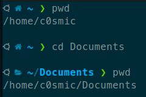
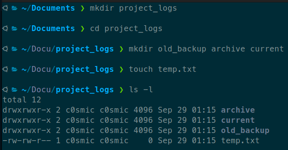

# Họ và tên: Võ Văn Tùng
# MSSV: 22120409
# Homework 1: Linux Command Line Basics

## Task 1: System Investigation
- Find out what directory you are currently in.
    - Dùng lệnh `pwd`
    - Lệnh pwd hiển thị đường dẫn tuyệt đối của thư mục hiện tại
- Go to the Documents directory inside your home directory using a relative path
    - Dùng lệnh `cd Documents`
    - Lệnh `cd` dùng để thay đổi thư mục hiện tại, sử dụng "Documents" như một đường dẫn tương đối có nghĩa là chúng ta di chuyển đến thư mục Documents trong thư mục hiện tại.
- Confirm your new location
    - Dùng lệnh `pwd`
    - Lệnh `pwd` hiển thị đường dẫn tuyệt đối của thư mục hiện tại, giúp xác nhận rằng đã di chuyển đến thư mục Documents.
- Kết quả:
    

## Task 2: Directory Setup
- Create a folder named project_logs in your current directory
    - Dùng lệnh `mkdir project_logs`
    - Lệnh `mkdir` được sử dụng để tạo một thư mục mới có tên là "project_logs" trong thư mục hiện tại.
- Inside it, create subfolders old_backup, archive, and current. Then, create a file temp.txt
    - Dùng lệnh: 

        `cd project_logs`

        `mkdir old_backup archive current`

        `touch temp.txt`
    - Lệnh `cd project_logs` chuyển vào thư mục "project_logs" vừa tạo. Lệnh `mkdir old_backup archive current` tạo ba thư mục con bên trong "project_logs". Lệnh `touch temp.txt` tạo một tệp trống có tên "temp.txt" trong thư mục hiện tại.
- Verify that they exist.
    - Dùng lệnh `ls -l`
    - Lệnh `ls -l` liệt kê các tệp và thư mục trong thư mục hiện tại với định dạng chi tiết, xác nhận rằng các thư mục con và tệp đã được tạo thành công.
- Kết quả:
    

## Task 3: Log Review
- You received a system log file at /var/log/syslog.
- Display the last 10 lines and the first 5 lines of the file.
    - Dùng lệnh `tail -10 /var/log/syslog` và `head -5 /var/log/syslog`
    - Lệnh `tail -10 /var/log/syslog` hiển thị 10 dòng cuối cùng của file được chỉ định, trong khi lệnh `head -5 /var/log/syslog` hiển thị 5 dòng đầu tiên của file.
- Reverse the content of the file for a quick scan.
    - Dùng lệnh `tac /var/log/syslog`
    - Lệnh `tac` đảo ngược thứ tự các dòng trong file, hiển thị dòng cuối trước.
- Kết quả:
